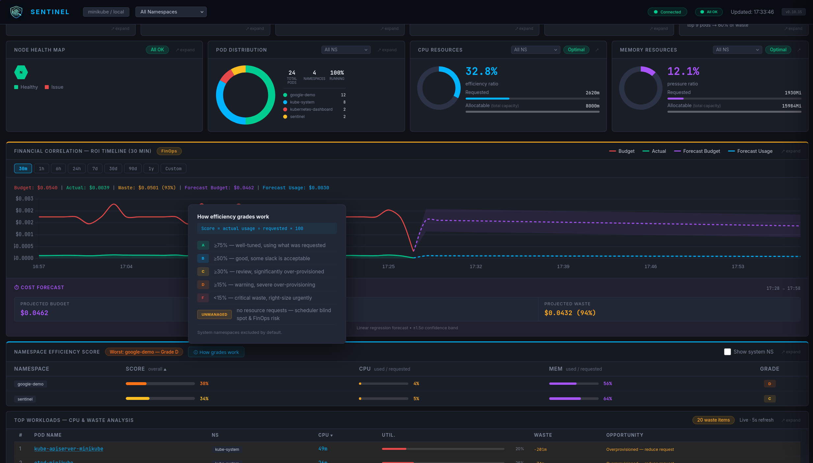
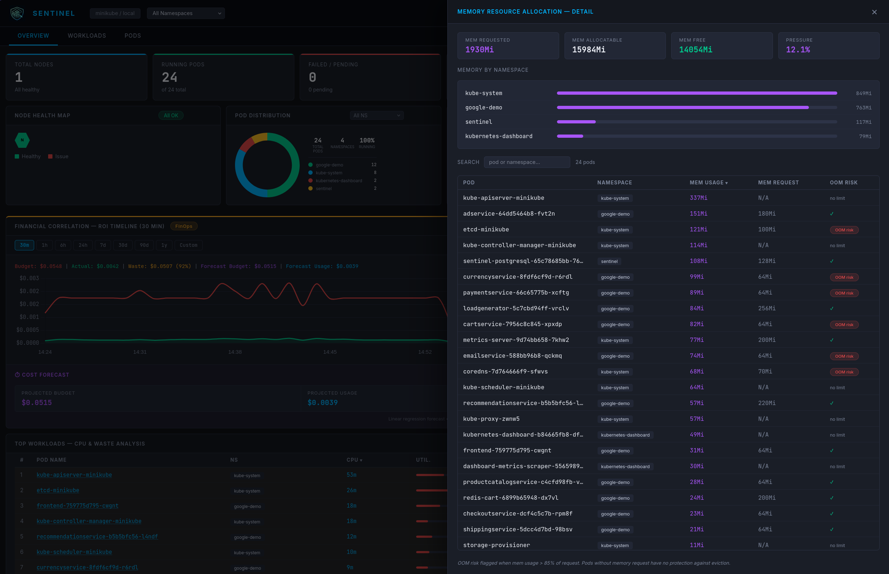

# Sentinel-Gemini

<p align="center">
  
</p>

> **Kubernetes SRE intelligence for teams that can't afford a dedicated specialist.**
> Incident detection, waste analysis, cost forecasting and AI-powered explanations — no Prometheus required.

<p align="center">
  
</p>


---

## What is Sentinel-Gemini?

Sentinel-Gemini is a standalone SRE and FinOps intelligence platform for Kubernetes. It continuously collects metrics via the Kubernetes Metrics API, persists data in PostgreSQL, calculates waste per pod and deployment, scores namespace efficiency and serves an interactive real-time dashboard — with no dependency on Prometheus, Grafana or AlertManager.

**Philosophy:** Observability-first, intelligence-second. If the LLM goes down, Sentinel-Gemini keeps working through deterministic rules. If the dashboard fails, the API remains usable.

**Architecture Layers:**

- **Go Agent** — standalone binary that collects, persists and exposes a web dashboard (port 8080)
- **Sentinel-Gemini Analysis Layer** — consumes the agent API, applies reasoning and generates runbooks

---

## Why Sentinel-Gemini?

Most small engineering teams overpay for Kubernetes without knowing it. Tools like Kubecost or Harness are built for enterprise budgets and dedicated FinOps teams. Sentinel-Gemini is built for the SRE or platform engineer who wears multiple hats — reliability, cost, and operations all at once.

- **Zero external monitoring stack** — no Prometheus, no Grafana, no AlertManager
- **FinOps native** — waste per pod and deployment, linear forecast, namespace efficiency grades
- **AI that explains, not replaces** — deterministic rules detect the problem; LLM reasoning explains it in plain language
- **Simple deploy** — Helm chart, single namespace, up in minutes

---

## Screenshots

| Dashboard Overview | Waste Intelligence — By Deployment |
|---|---|
| .png) | .png) |

| Status Page | Namespace Efficiency Score |
|---|---|
| .png) |  |

---

## Architecture

```
┌─────────────────────────────────────────────────────┐
│                   Go Agent (port 8080)              │
│                                                     │
│  continuous collection (~10s) → PostgreSQL          │
│  /api/summary    /api/metrics   /api/history        │
│  /api/forecast   /api/pods      /api/waste          │
│  /api/efficiency /health        /status             │
│                                                     │
│  Dashboard: KPIs → tiles → drawers → rightsizing    │
└───────────────────────┬─────────────────────────────┘
                        │ REST API
                        ▼
┌─────────────────────────────────────────────────────┐
│                  Sentinel-Gemini Analysis           │
│  /startup   → checks Minikube + Go agent            │
│  /incident  → logic analysis + runbook via harness  │
└─────────────────────────────────────────────────────┘
```

---

## Stack

| Layer | Technology |
|---|---|
| Cluster | Minikube (KVM2) — Kubernetes v1.35.1 |
| Agent | Go 1.23 (client-go, net/http, slog, embed) |
| Persistence | PostgreSQL (`sentinel_db`) — runs as a pod in the cluster |
| Dashboard | HTML + CSS + Chart.js (embedded in binary) |
| Integrations | MCP Server kubectl |

---

## Prerequisites

- Minikube running with Metrics Server enabled
- Go 1.23+ (only for local development without Helm)

> **Note:** PostgreSQL is **not a local prerequisite**. It is provisioned automatically as a pod in the `sentinel` namespace by the Helm chart.

---

## Setup

### Go Agent

**Option A: deploy on Kubernetes via Helm (recommended)**

```bash
# Build the image
podman build -t localhost/sentinel:0.10.17 agent/
podman save localhost/sentinel:0.10.17 | minikube image load -

# Deploy (PostgreSQL spins up automatically as a pod)
helm install sentinel helm/sentinel-gemini -n sentinel --create-namespace \
  --set image.tag=0.10.17 \
  --set image.pullPolicy=Never

# Check pods
kubectl get pods -n sentinel

# Access (default NodePort: 30080)
minikube ip   # → use http://<minikube-ip>:30080
```

**Option B: standalone (local development)**

```bash
# Requires local PostgreSQL with database sentinel_db
export DB_USER=postgres
export DB_PASSWORD=postgres
export DB_NAME=sentinel_db
export DB_HOST=localhost
export DB_SSLMODE=disable

cd agent
make build   # compile binary
make start   # start service in background
```

---

## Project Structure

```
sentinel-gemini/
├── ROADMAP.md                       # Milestones M1–M7 toward v1.0
├── README.md
├── agent/
│   ├── main.go                      # Go agent: entry point + setup
│   ├── pkg/                         # Core modules:
│   │   ├── api/                     # API handlers, OpenAPI, Swagger
│   │   ├── incidents/               # Incident detection & severity
│   │   ├── k8s/                     # Metrics collection & K8s client
│   │   └── store/                   # PostgreSQL persistence & queries
│   ├── Dockerfile                   # Multi-stage Alpine build
│   ├── go.mod / go.sum
│   ├── Makefile
│   └── static/
│       ├── dashboard.html           # Dashboard (embedded)
│       └── ...                      # CSS/JS/Assets
├── helm/sentinel-gemini/            # Kubernetes Helm chart
├── config/
│   └── thresholds.yaml              # Operational thresholds
├── tools/
│   ├── monitor.py                   # Monitor via Go agent API
│   └── report_tool.py               # Safe write via harness
├── harness/
│   ├── validador_saida.py           # Gatekeeper
│   └── test_validador_saida.py      # Unit tests
└── docs/
    └── screenshots/                 # Dashboard screenshots
```

---

## License

Distributed under the [Apache 2.0](LICENSE) license.
