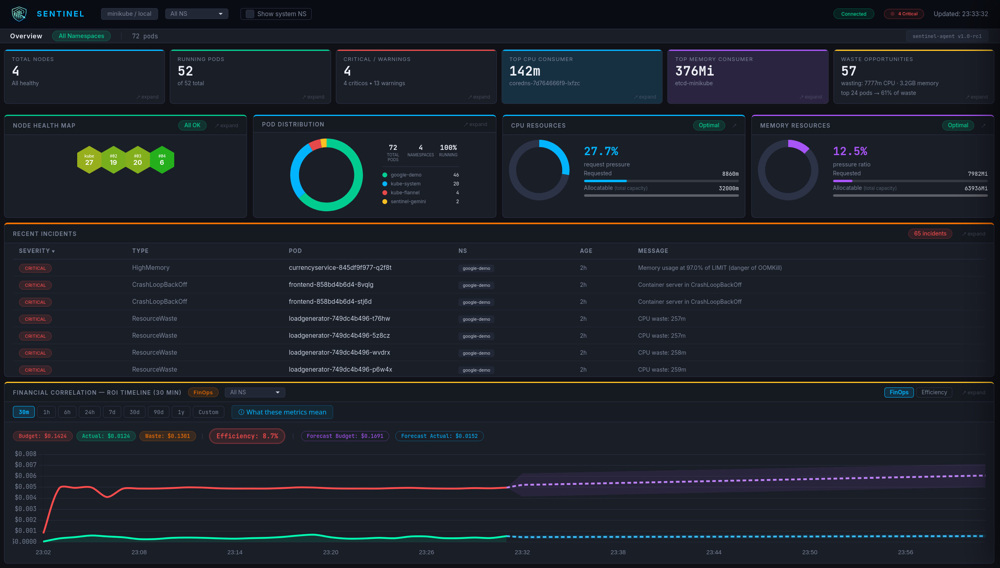

# Sentinel

<p align="center">
  
</p>

> **Kubernetes SRE intelligence for teams that can't afford a dedicated specialist.**
> Incident detection, waste analysis, cost forecasting and agentic investigation — no Prometheus required.

<p align="center">
  
</p>


---

## What is Sentinel?

Sentinel is a standalone SRE and FinOps intelligence platform for Kubernetes. It continuously collects metrics via the Kubernetes Metrics API, persists data in PostgreSQL, calculates waste per pod and deployment, scores namespace efficiency and serves an interactive real-time dashboard — with no dependency on Prometheus, Grafana or AlertManager.

**Philosophy:** Observability-first, intelligence-second. The v1.0 agent is fully useful through deterministic rules. If the dashboard fails, the API remains usable.

**Architecture direction:**

- **Sentinel Core (OSS)** — standalone Go agent that collects, persists and exposes the dashboard, API and deterministic analysis pipeline
- **Sentinel Intelligence (optional, planned)** — additive investigation layer for guided RCA, evidence correlation and controlled action planning on top of the OSS core

Model selection is an internal backend concern. Sentinel Intelligence is designed to remain vendor-agnostic, so provider, model version, fallback and routing strategy can change without changing the public product contract.

---

## Why Sentinel?

Most small engineering teams overpay for Kubernetes without knowing it. Tools like Kubecost or Harness are built for enterprise budgets and dedicated FinOps teams. Sentinel is built for the SRE or platform engineer who wears multiple hats — reliability, cost, and operations all at once.

- **Zero external monitoring stack** — no Prometheus, no Grafana, no AlertManager
- **FinOps native** — waste per pod and deployment, linear forecast, namespace efficiency grades
- **Deterministic first** — rules detect problems without LLM; optional Intelligence Layer investigates and proposes remediation
- **Production-first deploy** — Helm chart, explicit secrets, ClusterIP service and Ingress/TLS guidance

---

## Screenshots

| Dashboard Overview | Status Page |
|---|---|
| .png) | .png) |

| Incident Detail (HighMemory) | Waste Intelligence |
|---|---|
| .png) | .png) |

| Namespace Efficiency Grades | |
|---|---|
| .png) | |

---

## Lab Reports & Evidence

As part of our commitment to transparency and battle-tested engineering, we maintain a collection of technical reports from our chaos experiments and capacity planning sessions.

- [**M6 Chaos Lab Stress Test**](docs/reports/2026-04-22-m6-chaos-lab-stress-test.md) — High load (1000 users) and resource starvation validation.
- [**Capacity Planning: Online Boutique**](docs/reports/2026-04-22-capacity-planning-online-boutique.md) — Rightsizing analysis and memory undersizing detection.

---

## Quality Evidence

Release candidates are gated by:

```bash
cd agent && go test ./...
python3 harness/test_output_validator.py
helm lint helm/sentinel --set agent.auth.token=test-token --set database.password=test-password
```

Smoke test for a running agent:

```bash
BASE_URL=https://sentinel.example.com AUTH_TOKEN=<token> ./harness/smoke_api.sh
```

Operational release notes are maintained in [RELEASE.md](RELEASE.md).
Version-by-version changes are tracked in [CHANGELOG.md](CHANGELOG.md).

---

## Architecture

```
sentinel-core (OSS)
┌──────────────────────────────────────────────────────────┐
│ Go Agent (port 8080)                                     │
│                                                          │
│ collection (~10s) -> PostgreSQL                          │
│ rules engine -> deterministic incidents                  │
│ /api/summary   /api/metrics   /api/history               │
│ /api/forecast  /api/pods      /api/waste                 │
│ /api/efficiency /api/incidents /health                   │
│ /status        /docs          /openapi.yaml              │
│                                                          │
│ Dashboard: KPIs -> tiles -> drawers -> rightsizing       │
└──────────────────────────┬───────────────────────────────┘
                           │ incident context + APIs
                           ▼
sentinel-intelligence (planned)
┌──────────────────────────────────────────────────────────┐
│ Intelligence window / investigation workspace            │
│                                                          │
│ incident intake -> model routing -> investigation loop   │
│ tool calls: describe · logs · top · events               │
│ evidence correlation -> RCA synthesis -> action plan     │
│ user confirms / modifies / rejects                       │
│ workflow trace -> report / audit trail                   │
│                                                          │
│ Optional and additive: core remains usable without it    │
└──────────────────────────────────────────────────────────┘
```

Sentinel Intelligence is a product layer, not a dependency of the core runtime. The OSS agent remains useful with deterministic rules even when no LLM provider is configured.
Provider choice, model versioning and workload routing are backend-controlled implementation details and are not part of the user-facing feature contract.

---

## Stack

| Layer | Technology |
|---|---|
| Cluster | Any Kubernetes cluster (v1.19+, Metrics Server required) |
| Agent | Go 1.25 (client-go, net/http, slog, embed) |
| Persistence | PostgreSQL (`sentinel_db`) — runs as a pod in the cluster |
| Dashboard | HTML + CSS + Chart.js (embedded in binary) |
| Intelligence Layer | Optional (planned) — provider-agnostic investigation layer over the OSS core, with backend-controlled model routing and guarded tool workflows |

---

## Prerequisites

- A Kubernetes cluster (v1.19+) with Metrics Server enabled
- `kubectl` configured with access to the target cluster
- Helm 3
- Go 1.25+ (only for local development without Helm)

> **Note:** PostgreSQL is **not a local prerequisite**. It is provisioned automatically as a pod in the `sentinel` namespace by the Helm chart.

---

## Support Matrix

The current support matrix is published in [docs/support-matrix.md](docs/support-matrix.md).

| Category | v1.0.0-rc.2 status |
|---|---|
| Supported | Kubernetes `v1.19+`, Helm 3, PostgreSQL 15, Metrics Server, deterministic rules |
| Tested | Go unit tests, harness safety tests, Helm lint, chaos lab and capacity planning reports |
| Not supported | Production NodePort exposure, local LLM runtimes, multi-cluster aggregation, write-path remediation automation |

Metrics Server is required for production-quality metrics, incidents and FinOps calculations. Without it, Sentinel can serve the API/dashboard shell, but metrics-backed views are degraded or empty.

---

## Setup

### 1. Clone the repository

```bash
git clone https://github.com/boccato85/Sentinel
cd Sentinel
```

### 2. Go Agent

**Option A: production-style Kubernetes deploy via Helm + Ingress (recommended)**

```bash
# Generate secure secrets
AUTH_TOKEN=$(python3 -c "import secrets; print(secrets.token_hex(32))")
DB_PASSWORD=$(python3 -c "import secrets; print(secrets.token_urlsafe(32))")

# Deploy - pulls image from GHCR, PostgreSQL spins up automatically as a pod.
# Assumes your ingress controller is installed and the TLS secret already exists.
# Production example values: helm/sentinel/values.production.yaml
helm install sentinel helm/sentinel -n sentinel --create-namespace -f helm/sentinel/values.production.yaml \
  --set image.repository=ghcr.io/boccato85/sentinel \
  --set image.tag=1.0.0-rc.2 \
  --set agent.auth.token=$AUTH_TOKEN \
  --set database.password=$DB_PASSWORD \
  --set ingress.hosts[0].host=sentinel.example.com \
  --set ingress.tls[0].hosts[0]=sentinel.example.com

# Check pods
kubectl get pods -n sentinel

# Access via https://sentinel.example.com and enter the token in the dashboard session prompt
```

**Option B: Kubernetes dev/lab deploy via NodePort**

```bash
AUTH_TOKEN=$(python3 -c "import secrets; print(secrets.token_hex(32))")
DB_PASSWORD=$(python3 -c "import secrets; print(secrets.token_urlsafe(32))")

helm install sentinel helm/sentinel -n sentinel --create-namespace \
  --set agent.auth.token=$AUTH_TOKEN \
  --set database.password=$DB_PASSWORD \
  --set service.type=NodePort \
  --set service.nodePort=30080

# Dashboard: http://<node-ip>:30080 and enter the token in the dashboard session prompt
```

**Option C: docker-compose (local development - no cluster required)**

```bash
cp .env.example .env   # fill DB_PASSWORD and AUTH_TOKEN
# Generate AUTH_TOKEN: python3 -c "import secrets; print(secrets.token_hex(32))"
docker compose up --build
# Dashboard: http://localhost:8080 and enter the token in the dashboard session prompt
```

Requires a kubeconfig at `~/.kube/config` pointing to your cluster. Without a cluster, the agent starts and serves the API with empty data — suitable for UI/API development.

**Option D: standalone binary (requires local PostgreSQL)**

```bash
# Requires local PostgreSQL with database sentinel_db
export DB_USER=<your-postgres-user>
export DB_PASSWORD=<your-postgres-password>
export DB_NAME=sentinel_db
export DB_HOST=localhost
export DB_SSLMODE=disable

cd agent
make build   # compile binary
./sentinel-agent
```

Configurable retention:

```bash
export RETENTION_RAW_HOURS=24       # raw metrics (~10s)
export RETENTION_HOURLY_DAYS=30     # hourly aggregates
export RETENTION_DAILY_DAYS=365     # daily aggregates
```

---

## Usage

**Access the dashboard:**
```bash
# Production path: use the configured Ingress host.
# Dev/lab path: use NodePort only when explicitly enabled.

# https://sentinel.example.com
```

**API (authenticated):**
```bash
curl -H "Authorization: Bearer <AUTH_TOKEN>" https://sentinel.example.com/api/incidents
curl -H "Authorization: Bearer <AUTH_TOKEN>" https://sentinel.example.com/api/summary
```

**Incident investigation (Intelligence Layer — v1.1 planned):**
The v1.0 agent is deterministic-only. M8 will add a provider-agnostic cloud LLM investigation layer over read-only Kubernetes tools, with human approval before any write-path action.

---

## API Endpoints

| Endpoint | Description |
|---|---|
| `GET /` | Interactive dashboard (HTML) |
| `GET /status` | Status page — 4 component health cards with auto-refresh |
| `GET /health` | JSON: agent status, version, DB and collector |
| `GET /api/summary` | Nodes, pods, allocatable CPU/Mem |
| `GET /api/metrics` | Per-pod metrics: usage, request, waste, memRequest |
| `GET /api/pods` | Full pod list with phase and namespace |
| `GET /api/history?range=X` | Cost history (30m/1h/6h/24h/7d/30d/90d/365d/custom) |
| `GET /api/forecast?range=X` | Linear forecast with ±1.5σ confidence band |
| `GET /api/workloads` | Deployments and StatefulSets with replica status, image and age |
| `GET /api/events` | Kubernetes events sorted by timestamp descending |
| `GET /api/waste` | Per-pod waste: cpuUsage, cpuRequest, potentialSavingMCpu, appLabel, isSystem |
| `GET /api/efficiency` | Namespace efficiency score (grade A→F + UNMANAGED) |
| `GET /api/incidents` | Deterministic incidents: Pending, CrashLoop, OOMKilled, HighCPU, HighMemory, ResourceWaste |
| `GET /api/pods/{ns}/{pod}/logs` | Last 100 log lines from a pod container (plain text) |
| `GET /docs` | Swagger UI (CDN unpkg.com — no external build dependency) |
| `GET /openapi.yaml` | OpenAPI spec embedded in binary, covers all endpoints |

**Supported ranges:** `30m` `1h` `6h` `24h` `7d` `30d` `90d` `365d` `custom`

For custom range: `?range=custom&from=<ISO>&to=<ISO>`

---

## Dashboard Features

### KPI Strip
6 clickable cards at the top: Total Nodes, Active Pods, Failed Pods, Top CPU Consumer, Top Memory Consumer, Waste Opportunities. Each card opens a detailed drawer.

### Main Tiles (row-4)
- **Node Health Map** — honeycomb by node state; drawer with metrics glossary
- **Pod Distribution** — donut by namespace or phase; inherits NS filter; system NS toggle
- **CPU Resources** — allocation donut + Requested/Allocatable bar; NS filter; drawer with CPU Free + CPU Pressure
- **Memory Resources** — purple donut + pressure ratio; NS filter; Optimal/High/Critical badge

All drawers include an inline "ⓘ What these metrics mean" glossary card.

### Namespace Efficiency Score
Full-width panel with A→F grades per namespace. Scoring based on CPU Usage/Request ratio. Pods without `resources.requests` receive UNMANAGED grade (worse than F). Inline "How grades work" tooltip.

### Financial Correlation
Cost history chart (Budget vs Actual), dashed forecast line, ±1.5σ confidence bands and projected metric cards.

### Waste Intelligence
Waste table with two views in the drawer:
- **By Pod** — individual list with CPU/Mem waste, severity, namespace/severity/search filters and system NS toggle
- **By Deployment** — aggregated by `app` label: Deployment · Namespaces · Pods · CPU Saveable · Mem Not Used · Est. Saving

### Status Page (`/status`)
Standalone page with 5 health cards: Sentinel Agent, Database, Metrics Collector, Kubernetes API, Metrics API. Dynamic green/orange/red banner from `/health`. Auto-refresh every 10s.

### Connected Badge
Hover tooltip showing: Cluster, Endpoint, Version, Session uptime, Last sync, Database status.

---

## Agent Management

```bash
cd agent/
make setup    # create ../.env from ../.env.example if missing
make build    # compile sentinel-agent
make clean    # remove the compiled binary
make help     # print available targets
```

---

## Thresholds

Defined in `config/thresholds.yaml` — single source of truth, mounted via ConfigMap in Helm.

| Metric | WARNING | CRITICAL |
|---|---|---|
| CPU | > 70% | > 85% |
| Memory | > 75% | > 90% |
| Disk | > 70% | > 85% |
| Pod Pending | > 5min | — |
| Pod CrashLoopBackOff | — | immediate |
| Waste per pod | > 60% | — |

---

## Data Retention

| Layer | Granularity | Default retention | Env var |
|---|---|---|---|
| Raw | ~10s | 24h | `RETENTION_RAW_HOURS` |
| Hourly | 1h | 30 days | `RETENTION_HOURLY_DAYS` |
| Daily | 1 day | 365 days | `RETENTION_DAILY_DAYS` |

Aggregation and cleanup run automatically every hour.

---

## Environment Variables

The Sentinel Go Agent can be configured via environment variables. If using Helm, use the chart values shown in `helm/sentinel/values.yaml`.

| Variable | Default | Description |
|---|---|---|
| **API & Security** | | |
| `LISTEN_ADDR` | `0.0.0.0:8080` | Bind address and port for the dashboard and API. |
| `RATE_LIMIT_RPS` | `100` | Per-remote-address rate limit in requests per second. |
| `AUTH_ENABLED` | `true` | Enable Bearer token authentication for API endpoints (except `/health`). |
| `AUTH_TOKEN` | **(Required when auth enabled)** | The token required when `AUTH_ENABLED` is true. Agent refuses to start if empty. No default is provided — operator must supply a secret value. |
| **FinOps Pricing** | | |
| `USD_PER_VCPU_HOUR` | `0.04` | Cost of 1 CPU core (1000m) per hour, used for waste forecast. |
| `USD_PER_GB_HOUR` | `0.005` | Cost of 1 GB (1024MiB) of Memory per hour. |
| **Database** | | |
| `DB_USER` | (Required) | PostgreSQL user. |
| `DB_PASSWORD` | (Required) | PostgreSQL password. |
| `DB_NAME` | `sentinel_db` | PostgreSQL database name. |
| `DB_HOST` | `localhost` | PostgreSQL host. |
| `DB_PORT` | `5432` | PostgreSQL port. |
| `DB_SSLMODE` | `disable` | Set to `require` in production if connecting to an external DB. |
| `DB_CONNECT_RETRIES`| `10` | Max connection attempts on boot. |
| `DB_TIMEOUT_SEC` | `5` | Query timeout in seconds. |
| **Retention** | | |
| `RETENTION_RAW_HOURS`| `24` | Hours to keep minute-level raw data. |
| `RETENTION_HOURLY_DAYS`| `30` | Days to keep hourly aggregated data. |
| `RETENTION_DAILY_DAYS`| `365` | Days to keep daily aggregated data. |

The Intelligence Layer is planned for v1.1. v1.0 has no public LLM environment-variable contract.

---

## Project Structure

```
sentinel/
├── ROADMAP.md                       # Milestones M1–M7 toward v1.0
├── README.md
├── agent/
│   ├── main.go                      # Bootstrap, collector goroutine, HTTP server (~220 lines)
│   ├── main_test.go                 # Tests for main-package helpers
│   ├── Dockerfile                   # Multi-stage Alpine build
│   ├── go.mod / go.sum
│   ├── Makefile
│   ├── pkg/
│   │   ├── api/                     # HTTP handlers, types, middleware, Swagger
│   │   │   ├── api.go               # Types (PodStats, WasteEntry, Incident…), middleware
│   │   │   ├── api_handlers.go      # All HTTP handlers incl. /api/incidents
│   │   │   ├── api_test.go
│   │   │   ├── swagger.go           # /docs + /openapi.yaml handlers
│   │   │   ├── swagger-ui.html      # Swagger UI (CDN, embedded)
│   │   │   ├── openapi.go           # //go:embed openapi.yaml
│   │   │   └── openapi.yaml         # OpenAPI spec for all endpoints
│   │   ├── incidents/               # Threshold loading + deterministic analysis
│   │   │   ├── incidents.go
│   │   │   └── incidents_test.go
│   │   ├── k8s/                     # Kubernetes client + Metrics API wrappers
│   │   │   ├── k8s.go
│   │   │   └── k8s_test.go
│   │   ├── llm/                     # Provider interface (cloud LLM implementation in v1.1)
│   │   │   ├── client.go            # Provider interface + NewClient()
│   │   │   └── client_test.go
│   │   └── store/                   # PostgreSQL: schema, aggregation, retention
│   │       ├── store.go
│   │       └── store_test.go
│   └── static/
│       ├── dashboard.html           # Dashboard (embedded in binary via embed.FS)
│       ├── dashboard.css
│       ├── js/                      # Dashboard JS modules (loaded in order)
│       │   ├── 01-init.js           # State, auth, utilities
│       │   ├── 02-charts.js         # Chart.js wrappers
│       │   ├── 03-namespace.js      # Namespace/tab management
│       │   ├── 04-overview.js       # Overview tab + tile updaters
│       │   ├── 05-workloads.js      # Workloads, pods, efficiency, FinOps drawer
│       │   ├── 06-drawers.js        # Drawer engine + all 9 drawer renderers
│       │   └── 07-polling.js        # Event bindings, init calls
│       ├── status.html              # Status page (embedded)
│       └── icon.png
├── helm/sentinel/                   # Kubernetes Helm chart
│   ├── Chart.yaml
│   ├── values.yaml
│   └── templates/
├── config/
│   └── thresholds.yaml              # Operational thresholds
├── tools/
│   ├── monitor.py                   # Monitor via Go agent API
│   └── report_tool.py               # Safe write via harness
├── harness/
│   ├── output_validator.py          # Gatekeeper: blocks destructive commands
│   └── test_output_validator.py     # Unit tests (23 tests)
├── docs/
│   ├── screenshots/                 # Dashboard screenshots
│   └── reports/                     # Lab reports and chaos engineering evidence
├── .github/
│   └── workflows/
│       ├── ci.yml                   # Go tests + Helm lint on push/PR to main
│       └── release.yml              # Build + push to GHCR on semver tags
├── docker-compose.yml               # Local dev without Minikube (agent + PostgreSQL)
├── CONTRIBUTING.md                  # Dev setup, constraints, PR guidelines
└── SECURITY.md                      # Vulnerability disclosure and secure deployment
```

---

## Harness Engineering

Every final report passes through `harness/output_validator.py` before being written:

| Rule | Behavior |
|---|---|
| Blocks destructive commands | `rm -rf`, `kubectl delete`, `DROP TABLE`, fork bombs, `> /dev/` redirects |
| Blocks M5 remediation risks | `kubectl exec`, `kubectl apply -f -` (stdin), `kubectl scale --replicas=0`, `kubectl patch` with `replicas: 0`, `helm uninstall`, `helm delete` |
| Requires `## Resumo Executivo` | Reports without this section are rejected |
| Minimum size | Content under 100 characters is rejected |
| Maximum size | Content over 10 MB is rejected |
| Unicode normalization | NFKC + invisible character removal before pattern matching — prevents evasion via lookalike chars |

23 automated tests cover all patterns: `python3 harness/test_output_validator.py`

---

## Changelog

The full version history is maintained in [CHANGELOG.md](CHANGELOG.md).
For operator-facing guidance (install, upgrade, rollback, known limitations), see [RELEASE.md](RELEASE.md).

---

## Roadmap

See [ROADMAP.md](ROADMAP.md) for the full milestone breakdown (M1→M7, deliverables, done criteria and version history).

---

## License

Distributed under the [Apache 2.0](LICENSE) license.
