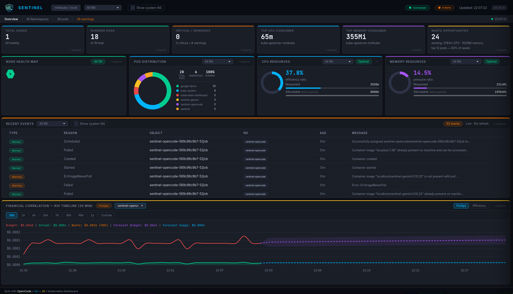

# Sentinel

<p align="center">
  
</p>

> **Kubernetes SRE intelligence for teams that can't afford a dedicated specialist.**
> Incident detection, waste analysis, cost forecasting and AI-powered explanations — no Prometheus required.

<p align="center">
  
</p>


---

## What is Sentinel?

Sentinel is a standalone SRE and FinOps intelligence platform for Kubernetes. It continuously collects metrics via the Kubernetes Metrics API, persists data in PostgreSQL, calculates waste per pod and deployment, scores namespace efficiency and serves an interactive real-time dashboard — with no dependency on Prometheus, Grafana or AlertManager.

**Philosophy:** Observability-first, intelligence-second. If the LLM goes down, Sentinel keeps working through deterministic rules. If the dashboard fails, the API remains usable.

**Two layers:**

- **Go Agent** — standalone binary that collects, persists and exposes a web dashboard (port 8080)
- **LLM Agent (optional)** — analysis layer that consumes the agent API, applies reasoning and generates runbooks

---

## Why Sentinel?

Most small engineering teams overpay for Kubernetes without knowing it. Tools like Kubecost or Harness are built for enterprise budgets and dedicated FinOps teams. Sentinel is built for the SRE or platform engineer who wears multiple hats — reliability, cost, and operations all at once.

- **Zero external monitoring stack** — no Prometheus, no Grafana, no AlertManager
- **FinOps native** — waste per pod and deployment, linear forecast, namespace efficiency grades
- **Deterministic first** — rules detect problems without LLM; optional LLM explains in plain language
- **Simple deploy** — Helm chart, single namespace, up in minutes

---

## Screenshots

| Dashboard Overview (v0.11) | Recent Events Drawer |
|---|---|
| .png) | .png) |

| Efficiency Tab | Waste Intelligence |
|---|---|
| .png) | .png) |

---

## Architecture

```
┌─────────────────────────────────────────────────────┐
│                   Go Agent (port 8080)              │
│                                                     │
│  continuous collection (~10s) → PostgreSQL          │
│  /api/summary    /api/metrics   /api/history        │
│  /api/forecast   /api/pods      /api/waste          │
│  /api/efficiency /api/incidents /health             │
│  /status         /docs          /openapi.yaml       │
│                                                     │
│  Dashboard: KPIs → tiles → drawers → rightsizing    │
└───────────────────────┬─────────────────────────────┘
                        │ REST API
                        ▼
┌─────────────────────────────────────────────────────┐
│                  LLM Agent (optional)                 │
│  /startup   → checks Minikube + Go agent            │
│  /incident  → LLM analysis + runbook via harness    │
└─────────────────────────────────────────────────────┘
```

---

## Stack

| Layer | Technology |
|---|---|
| Cluster | Minikube (KVM2) — Kubernetes v1.35.1 |
| Agent | Go 1.23 (client-go, net/http, slog, embed) |
| Persistence | PostgreSQL (`sentinel_db`) — runs as a pod in the cluster |
| Dashboard | HTML + CSS + Chart.js (embedded in binary) |
| LLM Agent | Optional — any LLM agent (Claude, Gemini, Minimax…) |

---

## Prerequisites

- Minikube running with Metrics Server enabled
- Go 1.23+ (only for local development without Helm)

> **Note:** PostgreSQL is **not a local prerequisite**. It is provisioned automatically as a pod in the `sentinel` namespace by the Helm chart.

---

## Setup

### 1. Clone and MCP Server

```bash
git clone https://github.com/boccato85/Sentinel
cd Sentinel
cd Sentinel
```

### 2. Go Agent

**Option A: deploy on Kubernetes via Helm (recommended)**

```bash
# Build the image
podman build -t localhost/sentinel:0.10.18 agent/
podman save localhost/sentinel:0.10.18 | minikube image load -

# Deploy (PostgreSQL spins up automatically as a pod)
helm install sentinel helm/sentinel -n sentinel --create-namespace \
  --set image.tag=0.10.18 \
  --set image.pullPolicy=Never

# Check pods
kubectl get pods -n sentinel

# Access (default NodePort: 30080)
minikube ip   # → use http://<minikube-ip>:30080
```

**Option B: standalone (local development)**

```bash
# Requires local PostgreSQL with database sentinel_db
export DB_USER=postgres
export DB_PASSWORD=postgres
export DB_NAME=sentinel_db
export DB_HOST=localhost
export DB_SSLMODE=disable

cd agent
make build   # compile binary
make start   # start service in background
```

Configurable retention:

```bash
export RETENTION_RAW_HOURS=24       # raw metrics (~10s)
export RETENTION_HOURLY_DAYS=30     # hourly aggregates
export RETENTION_DAILY_DAYS=365     # daily aggregates
```

---

## Usage

**Bootstrap:**
```
/startup
```
Checks Minikube and starts the Go agent if needed.

**Incident analysis:**
```
/incident
```
Consumes the Go agent API, applies LLM reasoning and generates a runbook via harness (requires LLM agent).

---

## API Endpoints

| Endpoint | Description |
|---|---|
| `GET /` | Interactive dashboard (HTML) |
| `GET /status` | Status page — 4 component health cards with auto-refresh |
| `GET /health` | JSON: agent status, version, DB and collector |
| `GET /api/summary` | Nodes, pods, allocatable CPU/Mem |
| `GET /api/metrics` | Per-pod metrics: usage, request, waste, memRequest |
| `GET /api/pods` | Full pod list with phase and namespace |
| `GET /api/history?range=X` | Cost history (30m/1h/6h/24h/7d/30d/90d/1y/custom) |
| `GET /api/forecast?range=X` | Linear forecast with ±1.5σ confidence band |
| `GET /api/waste` | Per-pod waste: cpuUsage, cpuRequest, potentialSavingMCpu, appLabel, isSystem |
| `GET /api/efficiency` | Namespace efficiency score (grade A→F + UNMANAGED) |
| `GET /api/incidents` | Deterministic incidents: Pending, CrashLoop, OOMKilled, HighCPU, HighMemory, ResourceWaste |
| `GET /docs` | Swagger UI (CDN unpkg.com — no external build dependency) |
| `GET /openapi.yaml` | OpenAPI spec embedded in binary, covers all endpoints |

**Supported ranges:** `30m` `1h` `6h` `24h` `7d` `30d` `90d` `1y` `custom`

For custom range: `?range=custom&from=<ISO>&to=<ISO>`

---

## Dashboard Features

### KPI Strip
6 clickable cards at the top: Total Nodes, Active Pods, Failed Pods, Top CPU Consumer, Top Memory Consumer, Waste Opportunities. Each card opens a detailed drawer.

### Main Tiles (row-4)
- **Node Health Map** — honeycomb by node state; drawer with metrics glossary
- **Pod Distribution** — donut by namespace or phase; inherits NS filter; system NS toggle
- **CPU Resources** — allocation donut + Requested/Allocatable bar; NS filter; drawer with CPU Free + CPU Pressure
- **Memory Resources** — purple donut + pressure ratio; NS filter; Optimal/High/Critical badge

All drawers include an inline "ⓘ What these metrics mean" glossary card.

### Namespace Efficiency Score
Full-width panel with A→F grades per namespace. Scoring based on CPU Usage/Request ratio. Pods without `resources.requests` receive UNMANAGED grade (worse than F). Inline "How grades work" tooltip.

### Financial Correlation
Cost history chart (Budget vs Actual), dashed forecast line, ±1.5σ confidence bands and projected metric cards.

### Waste Intelligence
Waste table with two views in the drawer:
- **By Pod** — individual list with CPU/Mem waste, severity, namespace/severity/search filters and system NS toggle
- **By Deployment** — aggregated by `app` label: Deployment · Namespaces · Pods · CPU Saveable · Mem Not Used · Est. Saving

### Status Page (`/status`)
Standalone page with 4 health cards: Sentinel Agent, Database, Metrics Collector, Kubernetes API. Dynamic green/orange/red banner from `/health`. Auto-refresh every 10s.

### Connected Badge
Hover tooltip showing: Cluster, Endpoint, Version, Session uptime, Last sync, Database status.

---

## Agent Management

```bash
cd agent/
make start    # compile + start in background
make stop     # stop the service
make restart  # recompile and restart
make status   # current state
make logs     # tail logs in real time
make build    # compile only
```

---

## Thresholds

Defined in `config/thresholds.yaml` — single source of truth, mounted via ConfigMap in Helm.

| Metric | WARNING | CRITICAL |
|---|---|---|
| CPU | > 70% | > 85% |
| Memory | > 75% | > 90% |
| Disk | > 70% | > 85% |
| Pod Pending | > 5min | — |
| Pod CrashLoopBackOff | — | immediate |
| Waste per pod | > 60% | — |

---

## Data Retention

| Layer | Granularity | Default retention | Env var |
|---|---|---|---|
| Raw | ~10s | 24h | `RETENTION_RAW_HOURS` |
| Hourly | 1h | 30 days | `RETENTION_HOURLY_DAYS` |
| Daily | 1 day | 365 days | `RETENTION_DAILY_DAYS` |

Aggregation and cleanup run automatically every hour.

---

## Environment Variables

The Sentinel Go Agent can be configured via environment variables. If using Helm, these can be set via the `agent.env` values.

| Variable | Default | Description |
|---|---|---|
| **API & Security** | | |
| `LISTEN_ADDR` | `0.0.0.0:8080` | Bind address and port for the dashboard and API. |
| `RATE_LIMIT_RPS` | `100` | Global rate limit in requests per second. |
| `AUTH_ENABLED` | `true` | Enable Bearer token authentication for API endpoints (except `/health`). |
| `AUTH_TOKEN` | `sentinel-secure-token` | The token required when `AUTH_ENABLED` is true. |
| **FinOps Pricing** | | |
| `USD_PER_VCPU_HOUR` | `0.04` | Cost of 1 CPU core (1000m) per hour, used for waste forecast. |
| `USD_PER_GB_HOUR` | `0.005` | Cost of 1 GB (1024MiB) of Memory per hour. |
| **Database** | | |
| `DB_USER` | (Required) | PostgreSQL user. |
| `DB_PASSWORD` | (Required) | PostgreSQL password. |
| `DB_NAME` | `sentinel_db` | PostgreSQL database name. |
| `DB_HOST` | `localhost` | PostgreSQL host. |
| `DB_PORT` | `5432` | PostgreSQL port. |
| `DB_SSLMODE` | `disable` | Set to `require` in production if connecting to an external DB. |
| `DB_CONNECT_RETRIES`| `10` | Max connection attempts on boot. |
| `DB_TIMEOUT_SEC` | `5` | Query timeout in seconds. |
| **Retention** | | |
| `RETENTION_RAW_HOURS`| `24` | Hours to keep minute-level raw data. |
| `RETENTION_HOURLY_DAYS`| `30` | Days to keep hourly aggregated data. |
| `RETENTION_DAILY_DAYS`| `365` | Days to keep daily aggregated data. |

---

## Project Structure

```
sentinel/
├── ROADMAP.md                       # Milestones M1–M7 toward v1.0
├── README.md
├── agent/
│   ├── main.go                      # Bootstrap, collector goroutine, HTTP server (~220 lines)
│   ├── main_test.go                 # Tests for main-package helpers
│   ├── Dockerfile                   # Multi-stage Alpine build
│   ├── go.mod / go.sum
│   ├── Makefile
│   ├── pkg/
│   │   ├── api/                     # HTTP handlers, types, middleware, Swagger
│   │   │   ├── api.go               # Types (PodStats, WasteEntry, Incident…), middleware
│   │   │   ├── api_handlers.go      # All HTTP handlers incl. /api/incidents
│   │   │   ├── api_test.go
│   │   │   ├── swagger.go           # /docs + /openapi.yaml handlers
│   │   │   ├── swagger-ui.html      # Swagger UI (CDN, embedded)
│   │   │   ├── openapi.go           # //go:embed openapi.yaml
│   │   │   └── openapi.yaml         # OpenAPI spec for all endpoints
│   │   ├── incidents/               # Threshold loading + deterministic analysis
│   │   │   ├── incidents.go
│   │   │   └── incidents_test.go
│   │   ├── k8s/                     # Kubernetes client + Metrics API wrappers
│   │   │   ├── k8s.go
│   │   │   └── k8s_test.go
│   │   └── store/                   # PostgreSQL: schema, aggregation, retention
│   │       ├── store.go
│   │       └── store_test.go
│   └── static/
│       ├── dashboard.html           # Dashboard (embedded in binary)
│       ├── dashboard.css
│       ├── dashboard.js
│       ├── status.html              # Status page (embedded)
│       └── icon.png
├── helm/sentinel/                   # Kubernetes Helm chart
│   ├── Chart.yaml
│   ├── values.yaml
│   └── templates/
├── config/
│   └── thresholds.yaml              # Operational thresholds
├── tools/
│   ├── monitor.py                   # Monitor via Go agent API
│   └── report_tool.py               # Safe write via harness
├── harness/
│   ├── validador_saida.py           # Gatekeeper: blocks destructive commands
│   └── test_validador_saida.py      # Unit tests (16 tests)
└── docs/
    └── screenshots/                 # Dashboard screenshots
```

---

## Harness Engineering

Every final report passes through `harness/validador_saida.py`:

| Rule | Behavior |
|---|---|
| Blocks destructive commands | `rm -rf`, `kubectl delete`, `DROP TABLE`, fork bombs etc. |
| Requires `## Resumo Executivo` | Reports without this section are rejected |
| Minimum size | Content under 100 characters is rejected |

---

## Changelog

### v0.11 — Dashboard v2: no-scroll layout + FinOps/Efficiency toggle
- **Dashboard v2 layout** — scroll-free overview optimized for single-screen monitoring
- **Tab bar removed** — replaced by thin context bar (Overview | NS | pods | warnings | status dot)
- **Workloads/Pods tabs eliminated** — data accessible via KPI expand + drawers
- **Compact layout** — main gap 14→10px, panel padding 14→10px, KPI padding 14→10px, donuts 88→72px
- **Recent Events tile** — full drawer with search debounce, NS selector, sortable columns, 220px height
- **FinOps/Efficiency toggle** — CSP-safe (addEventListener), fixed height 270px, line chart 140px
- **Efficiency tab** — donut 130px no text below, "How grades work" tooltip (A→F/UNMANAGED), NS breakdown table with sortable columns
- **FinOps drawer** — "What these metrics mean" glossary tooltip (Budget, Actual, Waste, Waste%, Proj., ±1.5σ)
- **Node Health legend removed** — badge OK/Issue already explains
- **Footer credits** — "Built with OpenCode + Go + JS • Kubernetes Dashboard"

### v0.10.18 — Multi-instance sync + UI parity + `/api/incidents` in dashboard
- **Sync from gemini instance** — `AuthMiddleware` + `AuthEnabled`/`AuthToken`, types extracted to `types.go`, `BuildPodSpecMap()` in `pkg/k8s`, `SystemNamespaces` exported
- **Dashboard parity with gemini** — all new UI elements added to opencode: global "Show system NS" toggle in header, "Critical / Warnings" KPI, per-tile namespace filters + system toggles in FinOps, Efficiency and Top Workloads panels
- **Metrics API card in `/status`** — 5th service card (Sentinel Agent, Database, Metrics Collector, Kubernetes API, Metrics API)
- **Native select/checkbox CSS** — `appearance: none`, custom dropdown arrows for `ns-select` and `tile-ns-select`
- **`/api/incidents` consumed by dashboard** — `updateOverview()` now fetches `/api/incidents`, distinguishes CRITICAL from WARNING, renders health incidents instead of failed/pending pod list
- **`tileNs` expanded** — 6 keys: `pods`, `cpu`, `mem`, `finops`, `eff`, `workloads` (was 3)
- **`loadNamespaces()` + `renderDropdowns()`** — system namespace filtering on all dropdowns; `sysNsList` array for consistent filtering
- **`fetchChart()` passes `system=` param** — backend respects include/exclude system NS in FinOps queries

### v0.10.17 — Packages + `/api/incidents` + Swagger UI
- **Refactored monolith → 4 packages** — `pkg/api`, `pkg/k8s`, `pkg/store`, `pkg/incidents`; `main.go` reduced from 2,282 to ~220 lines
- **`/api/incidents`** — deterministic incident detection: Pending pods, CrashLoop, OOMKilled, HighCPU, HighMemory, ResourceWaste (with severity and remediation hints)
- **Swagger UI at `/docs`** — served via CDN unpkg.com, no external build dependency
- **`/openapi.yaml`** — OpenAPI spec embedded in binary covering all endpoints
- **Per-package tests** — `go test ./...` covers all 5 packages (25 tests total)
- **Security hardening preserved** — all 21 items from commit `f6e6b1d` intact after refactoring

### v0.10.15 — M2: Waste by Deployment
- **By Deployment view** in Waste Intelligence drawer — aggregates by `app` label: Deployment · Namespaces · Pods · CPU Saveable · Mem Not Used · Est. Saving
- **By Pod | By Deployment toggle** with tab-style UI in drawer
- `appLabel` field added to `WasteEntry` Go struct and propagated via `/api/waste` (no new route)
- Namespace and "Show system NS" filters work across both views

### v0.10.14 — Namespace Efficiency Score + UX Polish
- **Namespace Efficiency Score** — full-width panel with A→F grades, "Worst" badge, fixed-position "How grades work" tooltip
- **"ⓘ What these metrics mean" card** — inline glossary in all 5 drawers
- **"Show system NS" toggle** in Waste, CPU, Mem and Pod Distribution drawers
- **Pod Distribution drawer** — inherits NS from tile, own dropdown, filtered stats
- **ph-expand always visible** — opacity 0.4 base, cyan on hover — all panels
- **gradeBadgeStyle()** helper with literal colors per grade
- **CPU drawer** — metrics renamed to CPU Free + CPU Pressure
- **WasteEntry Go struct** — `MemUsage`, `MemRequest`, `IsSystem` fields added

### v0.10.13 — Status Page
- **`/status` page** — animated health cards for 4 components: Sentinel Agent, Database, Metrics Collector, Kubernetes API
- Dynamic green/orange/red banner from `/health`; auto-refresh 10s

### v0.10.12
- **Unified panel** — Waste Intelligence + Top Workloads merged into "Top Workloads — CPU & Waste Analysis" (full-width)
- **Pod Detail Drawer** — click on pod name opens individual analysis: CPU/Mem bars, savings opportunity with concrete rightsizing suggestion (`ceil(usage × 1.2)`)
- **Waste row highlight** in amber (`.waste-row-hl`)

### v0.10.11
- **Connected badge tooltip** — hover shows Cluster, Endpoint, Version, Session uptime, Last sync, Database

### v0.10.10
- **Real `memRequest` per pod** — `PodStats` gained `MemRequest int64` field; DB INSERT uses real value (previously hardcoded `0`)

### v0.10.9
- **Fix Pod Distribution** — `ReferenceError: pods is not defined` blocked all KPI updates

### v0.10.8
- **Header Alert Badge** — animated dot: green "All OK" / orange / pulsing red
- **Full KPI strip** — 6 clickable cards opening drawers

### v0.10.6 — v0.10.7
- **row-4 layout** — Node Health | Pod Distribution | CPU compact | Memory compact

### v0.10.5
- **Per-tile namespace filters** — independent per panel
- **Financial Correlation hero** — full-width with FinOps orange border

### v0.10.4
- **Memory Resource Allocation tile** — purple donut, pressure ratio, Optimal/High/Critical badge

### v0.10.1 — M1 closed
- `/health` endpoint with DB and collector status
- Structured logging with `slog`
- **22 automated tests** (collection + waste calculation)
- Thresholds loaded from `config/thresholds.yaml` via ConfigMap

### v0.10.0
- **Cost Forecast** — OLS linear regression, ±1.5σ confidence band

### v0.7.3
- Fix Utilization bar — real `usage / request` calculation

### v0.7
- **Fully standalone** — all Prometheus/Grafana/AlertManager dependencies removed

### v0.6
- 3-layer retention (raw/hourly/daily) with automatic cleanup

### v0.5
- Complete Helm chart; automatic InClusterConfig; security hardening

### v0.4
- Go agent with real-time web dashboard (port 8080)
- FinOps: waste per pod + cost history in PostgreSQL

### v0.1 — v0.3
- Initial release: orchestrator + parallel sub-agents
- Automatic runbook and report generation
- MCP Server kubectl integration

---

## Roadmap

| Milestone | Status | Target version |
|---|---|---|
| M1 — Stable core (+ M5 self-observability) | ✅ Done | v0.10.1 |
| M2 — Actionable FinOps | ✅ Done | v0.10.15 |
| M3 — Deterministic incident intelligence | ✅ Done | v0.11 |
| M4 — Real lab with Online Boutique | Not started | v0.11 |
| M6 — Optional intelligence (LLM as a layer) | Partial (~20%) | v0.12 |
| M7 — v1.0 preparation | Not started | v1.0 |

See [ROADMAP.md](ROADMAP.md) for full details.

---

## License

Distributed under the [Apache 2.0](LICENSE) license.
